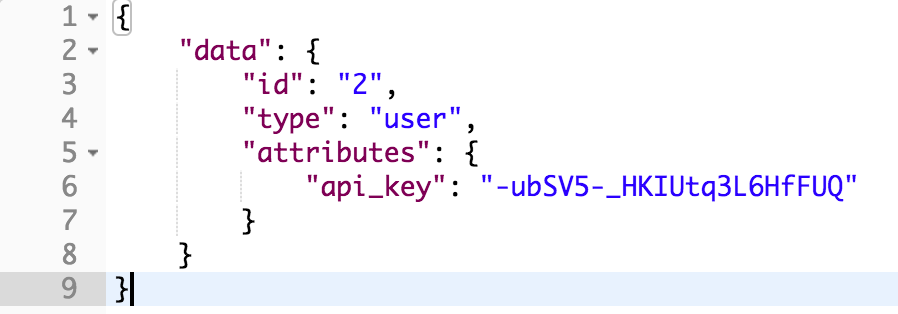
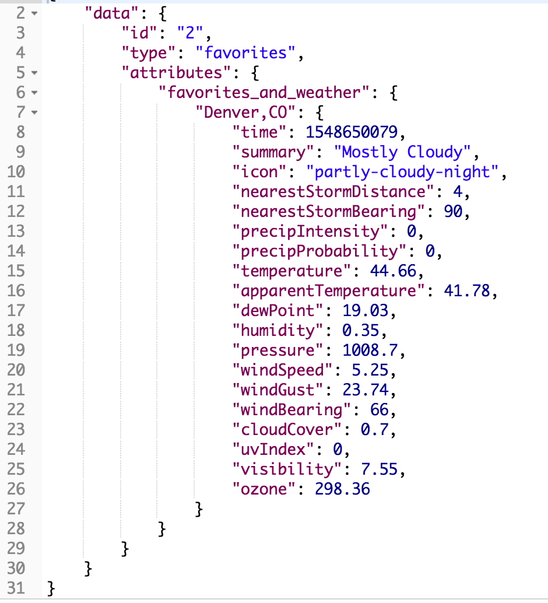
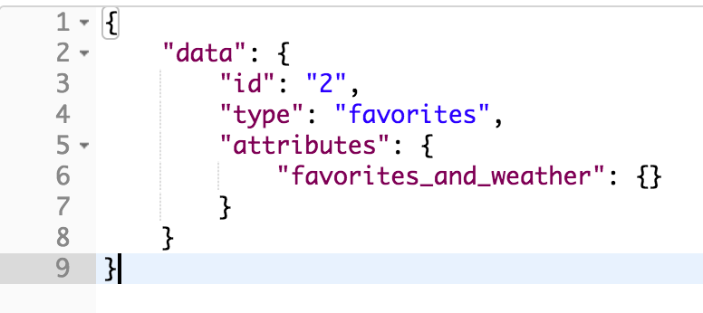

# README

<h1>Sweater Weather Backend API </h1>

<h3>Hosted on https://morning-dusk-81767.herokuapp.com/ </h3>

This API is built to serve current, hourly, and daily weather information for any given city. Sweater Weather is a Rails application that consumes the Google Geocode API, Dark Sky API, and Giphy API. 

The endpoints that are available are as follows: 

<h2>get /api/v1/forecast?location=denver,co</h2>

<ln>
 
Both of the following requests return the api_key of the current/registered user
<h2>post /api/v1/sessions?email=sample@email.com&password=test</h2>
<h2>post /api/v1/users?email=example@example.com&password=password&password_confirmation=password</h2>

 
 
<ln>
 
<h2>post /api/v1/favorites?location=denver,co&api_key=insertapi_keyhere</h2> (no return value)

<ln>
 
<h2>get /api/v1/favorites?api_key=abc123</h2>

<ln>

<h2>del /api/v1/favorites?location=denver,co&api_key=insert_api_key_here</h2>

<ln>
