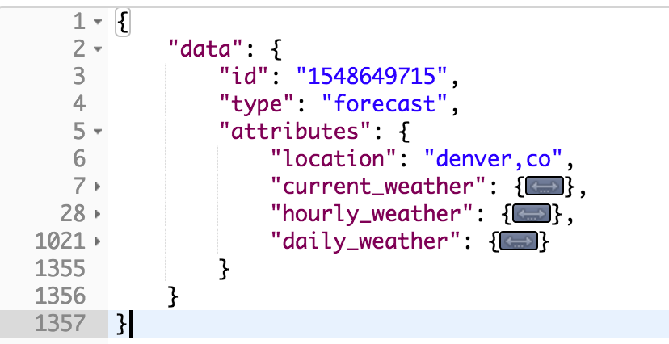

# README

<h1>Sweater Weather Backend API </h1>

<h3>Hosted on https://morning-dusk-81767.herokuapp.com/ </h3>

This API is built to serve current, hourly, and daily weather information for any given city. Sweater Weather is a Rails application that consumes the Google Geocode API and Dark Sky API. 

The endpoints that are available are as follows: 

<h2>get /api/v1/forecast?location=denver,co</h2>

<ln>
 
Both of the following requests return the api_key of the current/registered user
<h2>post /api/v1/sessions?email=sample@email.com&password=test</h2>
<h2>post /api/v1/users?email=example@example.com&password=password&password_confirmation=password</h2>

 
 
<ln>
 
<h2>post /api/v1/favorites?location=denver,co&api_key=insertapi_keyhere</h2> (no return value)

<ln>
 
<h2>get /api/v1/favorites?api_key=abc123</h2>

<ln>

<h2>del /api/v1/favorites?location=denver,co&api_key=insert_api_key_here</h2>

<ln>
 
 

<h1>Set Up</h1>

Clone this repository and perform the following instructions in your terminal:

1. git clone <github repo link>
2. cd sweater_weather
 
<h2>Versions</h2>
Sweater Weather was developed using Rails 5.2 and Ruby 2.4

<h2>Install</h2>
1. bundle install
2. rake db:{drop,migrate,seed} 
3. rails s (opens server)
4. visit http://localhost:3000 to access api endpoints locally

<h2> Testing </h2>
run 'rspec' in terminal to check testing coverage

<h2>Consuming Geocode and Dark Sky</h2>
You can register for a Dark Sky API here: https://darksky.net/dev
You can register for a Google Geocode API here: https://developers.google.com/maps/documentation/geocoding/get-api-key

<h2>Built With</h2>
Rails
Google API
DarkSky API
RSpec
ShouldaMatchers
Capybara
Launchy
SimpleCov
BCrypt
PostreSQL
Figaro

<h2>Author</h2>
Meghan Stang (mstang15)

